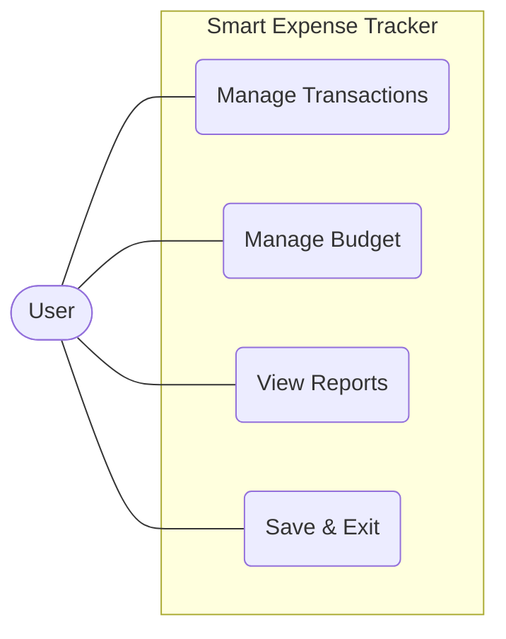
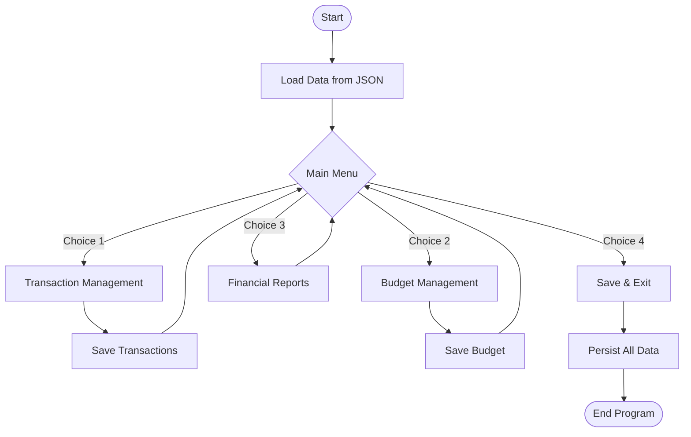
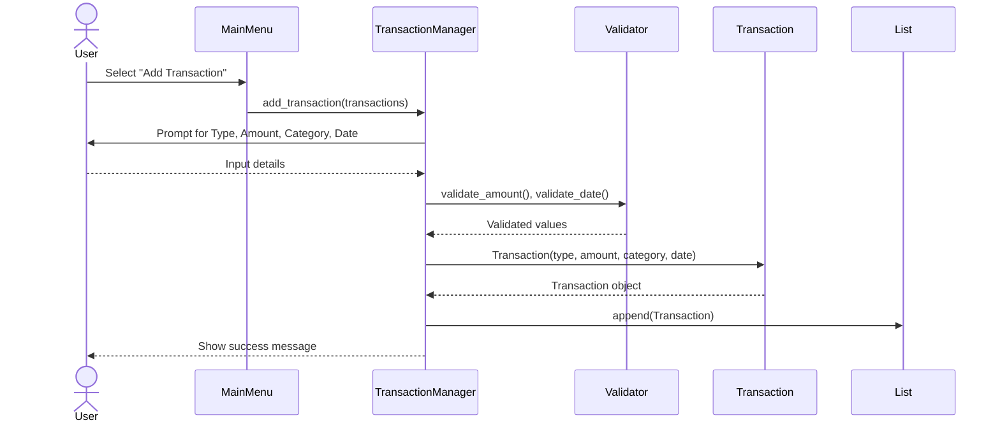
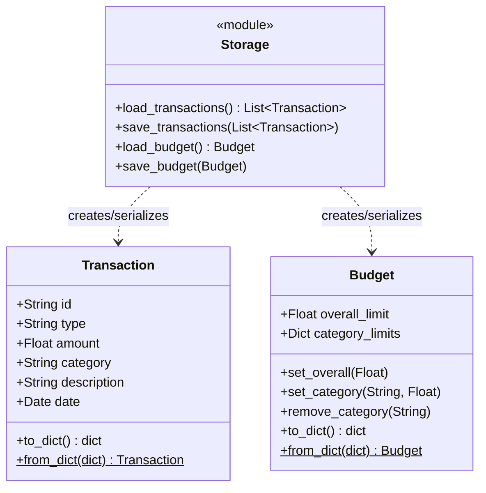
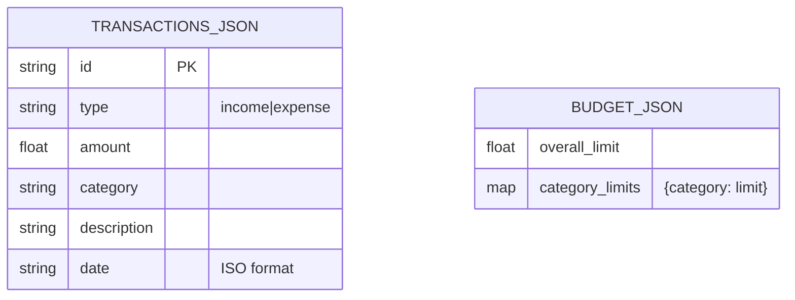

# Smart Expense Tracker
**A Python-Based Personal Finance Management System**

**Course:** Python Essentials  
**Deadline:** 30 September 2026

---

## 1. Introduction
The Smart Expense Tracker is a terminal-based personal finance application built entirely in Python. It empowers users to manage their income and expenses, set monthly budgets, and analyze their spending habits through various financial reports. The project strictly utilizes the Python Standard Library, demonstrating core concepts such as object-oriented programming (OOP), file handling, exception handling, data structures, and modular design.

## 2. Problem Statement
Managing personal finances is a fundamental life skill, yet many individuals lack accessible tools to track their income and spending habits. Commercial applications are often complex, subscription-based, or require an internet connection. This project addresses that gap by providing a simple, self-contained, command-line system that operates entirely offline, storing data locally in JSON format.

## 3. Functional Requirements
The system is divided into four major functional modules:

1. **Income and Expense Management:** Users can add, view, edit, and delete transactions. Transactions are categorized (e.g., Salary, Rent, Food).
2. **Budget Management:** Users can set an overall monthly spending limit and per-category limits. The system provides real-time warnings if spending exceeds 80% or 100% of these limits.
3. **Financial Reports and Analysis:** The system calculates total income, total expenses, balance, and savings rate. It provides category-wise breakdowns and monthly summaries.
4. **Data Storage and Validation:** Data is persistently stored in `data/transactions.json` and `data/budget.json`. The application validates all user inputs (amounts, dates, choices) to prevent crashes.

## 4. Non-Functional Requirements
- **Usability:** A simple, menu-driven terminal interface ensures ease of use without technical expertise.
- **Reliability:** Comprehensive input validation and exception handling ensure the application gracefully handles invalid data or missing files.
- **Maintainability:** The codebase is split into specific modules (`models`, `storage`, `validators`, etc.), adhering to the single responsibility principle.
- **Performance:** Efficient in-memory processing of transaction lists ensures O(n) operations suitable for personal finance scales.

## 5. System Architecture
The application follows a modular, monolithic architecture:
- **Presentation Layer:** Managed by `main.py` and the various `_manager.py` modules handling CLI menus.
- **Business Logic:** Encapsulated in pure functions within `report_manager.py`, `validators.py`, and `models.py`.
- **Data Access Layer:** Handled entirely by `storage.py` reading and writing to local JSON files.

## 6. Diagrams

### 6.1 Use Case Diagram
```mermaid
usecaseDiagram
    actor User
    
    package "Smart Expense Tracker" {
        usecase "Manage Transactions" as UC1
        usecase "Manage Budget" as UC2
        usecase "View Reports" as UC3
        usecase "Save and Exit" as UC4
    }

    User --> UC1
    User --> UC2
    User --> UC3
    User --> UC4
```
*(Note: Mermaid syntax for Use Case is limited, representing as a standard flowchart conceptualized as Use Case)*



### 6.2 Workflow Diagram


### 6.3 Sequence Diagram
*Example: Adding a Transaction*


### 6.4 Class/Component Diagram


### 6.5 ER / Storage Design
While a relational database is not used, the JSON document structure maps conceptually as follows:



## 7. Design Decisions and Rationale
- **JSON for Storage:** Chosen for simplicity, human-readability, and direct mapping to Python dictionaries. Does not require external database setups.
- **Pure Python Standard Library:** Ensures maximum portability and ease of installation for course evaluators (no `pip install` required).
- **OOP vs Functional:** Used OOP for `Transaction` and `Budget` entities to bundle data and behavior (serialization), satisfying course requirements. Used pure functions for calculations (`report_manager.py`) to ensure they are easily unit-testable without side effects.
- **UUID for IDs:** Using `uuid4()` truncated to 8 characters provides reliable unique identification for editing/deleting without maintaining complex auto-increment sequences across files.

## 8. Implementation Details
The codebase is structured into multiple files:
- `main.py`: The entry point managing the core loop.
- `src/models.py`: Defines the data structures.
- `src/storage.py`: Abstracts file I/O operations.
- `src/validators.py`: Centralized error checking.
- `src/transaction_manager.py`, `src/budget_manager.py`, `src/report_manager.py`: Controllers for the respective modules.
- `tests/test_transactions.py`: Houses 69 `unittest` test cases ensuring logic integrity.

## 9. Screenshots and Results
*(To be added manually in the final PDF)*
- [Insert screenshot of Main Menu]
- [Insert screenshot of Adding a Transaction]
- [Insert screenshot of Budget Status with Warning]
- [Insert screenshot of Monthly Summary Report]
- [Insert screenshot of Unit Tests Passing]

## 10. Testing Approach
The application is tested using Python's built-in `unittest` framework.
- **Unit Testing:** 69 isolated tests verify the logic of models, serialization, report calculations, and input validation.
- **Boundary Testing:** Edge cases (e.g., empty lists, invalid date strings, negative amounts) are explicitly tested to ensure the application does not crash.
- **Manual End-to-End Testing:** Simulated user flows through the CLI interface to verify state persistence and menu navigation.

## 11. Challenges Faced
- **Terminal UI State Management:** Ensuring the terminal output remains clean and legible when inputs fail validation required careful implementation of a retry loop.
- **Robust File Handling:** Early iterations crashed if `transactions.json` was missing or corrupted. This was resolved by implementing graceful fallbacks that create missing directories and return empty datasets instead of raising exceptions.

## 12. Learnings and Key Takeaways
- Modular programming significantly simplifies testing and debugging. By separating pure logic (calculations) from side effects (printing to the terminal), writing unit tests became much easier.
- Robust input validation is critical for CLI applications to prevent unexpected crashes.

## 13. Future Enhancements
- **Data Export:** Adding functionality to export reports to CSV or Excel formats.
- **Graphical User Interface (GUI):** Wrapping the existing logic modules with a Tkinter or PyQt interface.
- **Advanced Authentication:** Adding a login screen for multi-user support on a single machine.

## 14. References
- Python Software Foundation. (2026). *Python 3.8+ Documentation*. https://docs.python.org/3/
- Official Python `unittest` module documentation.
- Built-in `json` module documentation.
